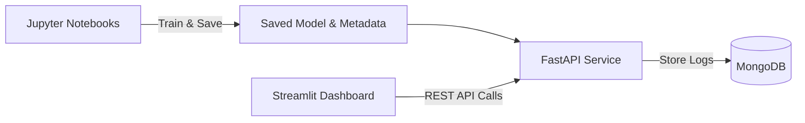

# Financial Fraud Detection System

An end-to-end machine learning system designed to detect fraudulent financial transactions in real time. The system features custom domain-specific feature engineering, model evaluation using precision-recall metrics, explainable AI with SHAP, a deployable FastAPI backend logging to MongoDB, and an interactive Streamlit dashboard.

---

## Problem Statement

In financial fraud detection, fraudulent transactions represent a minute fraction of overall activity—typically around **0.13%** of all transactions. 

Standard metric selection can be dangerously misleading: a dummy baseline model that blindly predicts "Not Fraud" for every single transaction achieves **99.70% accuracy** on the test set, yet fails to detect a single instance of fraud. Consequently, evaluating models on imbalanced financial data requires prioritizing **Precision**, **Recall**, and **Precision-Recall Area Under the Curve (PR-AUC)** rather than raw accuracy.

---

## Dataset

The model is trained on the [PaySim Synthetic Financial Datasets for Fraud Detection](https://www.kaggle.com/datasets/ealaxi/paysim1) available on Kaggle.

> **Note:** Dataset files are omitted from this repository due to size. Download `PS_20174392719_1491204439457_log.csv` from Kaggle and place it in the `data/` directory.

---

## Methodology & Approach

### 1. Exploratory Data Analysis (EDA)
- Analysis revealed that fraudulent transactions occur **exclusively** within `TRANSFER` and `CASH_OUT` transaction types.
- Filtering out all other transaction types (`PAYMENT`, `DEBIT`, `CASH_IN`) eliminated noise without losing any fraud positive cases.

### 2. Feature Engineering
Domain-specific features were engineered to capture balance discrepancies and behavioral patterns:
- **`errorBalanceOrig`**: `newbalanceOrig + amount - oldbalanceOrg` (measures whether the sender's balance change matches the transaction amount; fraud usually has near-zero error because the account is emptied exactly).
- **`errorBalanceDest`**: `oldbalanceDest + amount - newbalanceDest` (detects destination account balance manipulation).
- **`hour`**: `step % 24` (extracts hour of day to capture temporal fraud tendencies).
- **`is_transfer`**: Binary indicator differentiating `TRANSFER` from `CASH_OUT`.

### 3. Model Training & Comparison
We evaluated three classification models using stratified splits:
- **Logistic Regression**: Linear baseline scaled with `StandardScaler` and `class_weight='balanced'`.
- **Random Forest Classifier**: Ensemble of decision trees trained with balanced class weights.
- **XGBoost Classifier**: Gradient boosted decision trees configured with `scale_pos_weight`.

### 4. Stratified 5-Fold Cross-Validation & Ablation Study
- **5-Fold Cross-Validation**: Applied across folds to assess model stability and prevent split variance.
- **Ablation Test**: To quantify the impact of engineered features, models were re-trained without `errorBalanceOrig` and `errorBalanceDest`. Excluding balance error features caused Random Forest PR-AUC to collapse from **0.9983** to **0.8948** and Recall to drop from **99.7%** to **80.7%**, confirming that feature engineering is the primary driver of model performance.

### 5. Threshold Optimization & Explainability
- **Threshold Selection**: Tuning the decision boundary via cross-validation on training data yielded an optimal F1-score threshold of **0.60**, which performed about the same as the default 0.50 threshold on the test set.
- **SHAP Explainability**: TreeExplainer beeswarm and waterfall plots were generated to validate global feature impacts and provide clear local explanations for individual fraudulent transaction alerts.

---

## Results & Model Performance

### Single Train/Test Split Comparison (80/20 Split)

| Model | Precision | Recall | PR-AUC |
|---|---|---|---|
| **Random Forest** | **0.985** | **1.000** | **0.998** |
| **XGBoost** | 0.914 | 0.984 | 0.996 |
| **Logistic Regression (Baseline)** | 0.045 | 0.950 | 0.580 |

### 5-Fold Cross-Validation & Ablation Performance

| Model | PR-AUC (Mean ± Std) | Precision (Mean ± Std) | Recall (Mean ± Std) |
|---|---|---|---|
| **Random Forest (Full Features)** | **0.9983 ± 0.0031** | **0.9969 ± 0.0038** | **0.9969 ± 0.0062** |
| **XGBoost (Full Features)** | 0.9919 ± 0.0043 | 0.9255 ± 0.0167 | 0.9752 ± 0.0103 |
| **Random Forest (Ablated)** | 0.8948 ± 0.0147 | 0.9567 ± 0.0147 | 0.8068 ± 0.0292 |
| **XGBoost (Ablated)** | 0.9216 ± 0.0117 | 0.8019 ± 0.0305 | 0.8655 ± 0.0270 |

---

## System Architecture



---

## Project Structure

```
fraud-detection/
├── api/
│   └── main.py              # FastAPI service & endpoint definitions
├── dashboard/
│   └── app.py               # Streamlit analytics & inference UI
├── data/                    # Dataset directory (place Kaggle CSV here)
├── models/                  # Generated by notebook 06
│   ├── fraud_model.joblib   # Saved Random Forest model artifact
│   └── model_meta.json      # Metadata (threshold, feature list)
├── notebooks/
│   ├── 01_eda.ipynb         # Exploratory data analysis
│   ├── 02_features.ipynb    # Cleaning & feature engineering
│   ├── 03_baseline_model.ipynb # Dummy & Logistic Regression baseline
│   ├── 04_models.ipynb      # Model comparison (LR vs RF vs XGB)
│   ├── 05_validation.ipynb  # 5-fold CV & Ablation testing
│   └── 06_final_model.ipynb # Threshold tuning & SHAP explainability
├── src/
│   ├── db.py                # MongoDB connection & logging functions
│   └── features.py          # Feature transformation utilities
├── .env.example             # Example environment configuration
├── .gitignore
├── requirements.txt         # Pinned project dependencies
└── README.md
```

---

## How to Run Locally

### 1. Environment Setup
Clone the repository and create a Python virtual environment:
```bash
python -m venv venv
# On Windows:
.\venv\Scripts\Activate.ps1
# On Linux/macOS:
source venv/bin/activate

pip install -r requirements.txt
```

### 2. Database & Environment Configuration
Ensure MongoDB is running locally (e.g. `mongodb://localhost:27017`).
Copy `.env.example` to create your `.env` configuration:
```bash
cp .env.example .env
```

### 3. Data Processing & Model Training
Ensure the PaySim dataset CSV is placed in `data/`. Run the pipelines:
1. Open and execute `notebooks/02_features.ipynb` to generate `data/processed.csv`.
2. Open and execute `notebooks/06_final_model.ipynb` to train and export `models/fraud_model.joblib` and `models/model_meta.json`.

### 4. Start the Application
In separate terminal windows with virtual environment active:

**FastAPI Backend:**
```bash
uvicorn api.main:app --reload
```
*API running at http://127.0.0.1:8000*

**Streamlit Dashboard:**
```bash
streamlit run dashboard/app.py
```
*Dashboard running at http://localhost:8501*

---

## API Endpoints & Usage

### 1. Health Check
`GET /health`

Checks system operational status, model state, and MongoDB database connectivity.

### 2. Predict Fraud
`POST /predict`

Evaluates transaction risk and logs prediction records to MongoDB (if MongoDB is unavailable, the prediction is still returned successfully with `logged: false`).

**Example Request:**
```json
{
  "step": 3,
  "type": "TRANSFER",
  "amount": 500000.0,
  "oldbalanceOrg": 500000.0,
  "newbalanceOrig": 0.0,
  "oldbalanceDest": 0.0,
  "newbalanceDest": 0.0
}
```

**Example Response:**
```json
{
  "fraud_probability": 1.0,
  "is_fraud": true,
  "threshold_used": 0.6,
  "logged": true
}
```

### 3. List Recent Predictions
`GET /predictions?limit=20`

Fetches recent transaction predictions and risk scores stored in MongoDB.

---

## Limitations & Next Steps

- **Synthetic Data Constraints**: PaySim is a synthetic dataset generated by agent-based simulation. Real-world financial environments feature more complex temporal dynamics and customer network relationships.
- **Docker Deployment**: Packaging the service components (FastAPI, Streamlit, MongoDB) into Docker container orchestrations to simplify cloud environment deployments.
- **Drift Monitoring**: Introducing continuous data drift and concept drift monitoring pipelines to automatically trigger model retraining as fraudulent behavior patterns evolve.
